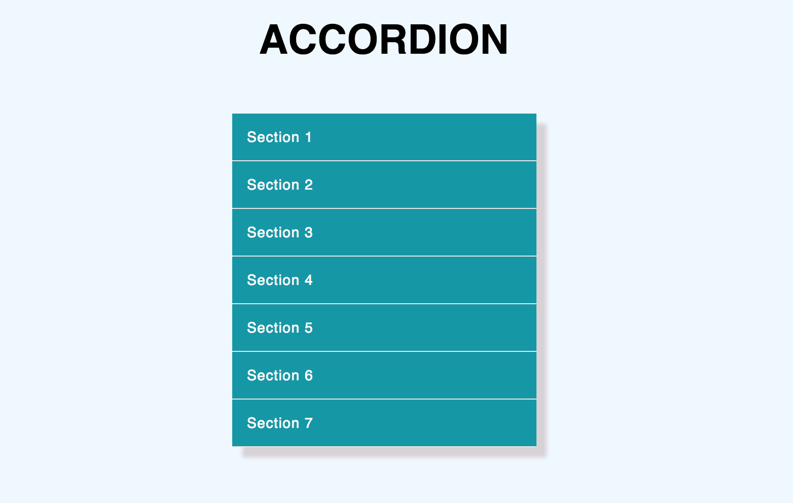

# Accordion

Accordion built in vanilla JavaScript with a request AJAX

[See it online](https://judithgo.github.io/Accordion/)️ ↗️

## Screenshoot



## Getting Started

Install the dependencies

```sh
npm i
```

Build the folder dist

```sh
npm run prod
```

Run the application.

```sh
npm run dev
```

Go to:

```sh
http://localhost:3000/
```

## Test JEST

Launches the test runner with JEST.

```sh
npm test
```

## Test CYPRESS

Launches the test runner with CYPRESS. 

```sh
npm run dev
```

Go to:

```sh
http://localhost:3000/
```
In other terminal window:

```sh
npm run test:cypress
```
Selects the test to be run.

# Accordion Exercise

## Frontend Exercise

With the next markup, you must create an accordion (JS / CSS) show only the contents of a section at a time.
Sure to follow the [SUIT](https://suitcss.github.io/) convention when working with CSS.


```html
<dl>
  <dt>Section 1</dt>
  <dd>
    <p>Section 1 Content...</p>
  </dd>
  <dt>Section 2</dt>
  <dd>
    <p>Section 2 Content...</p>
  </dd>
  <dt>Section 3</dt>
  <dd>
    <p>Section 3 Content...</p>
  </dd>
</dl>
```

### Conditions
* Use Sass for generate CSS
* Use ES6
* Use only Vanilla JS, without any JS framework
* Generate gh-page for publish


### Bonus
* Add new section with Ajax content